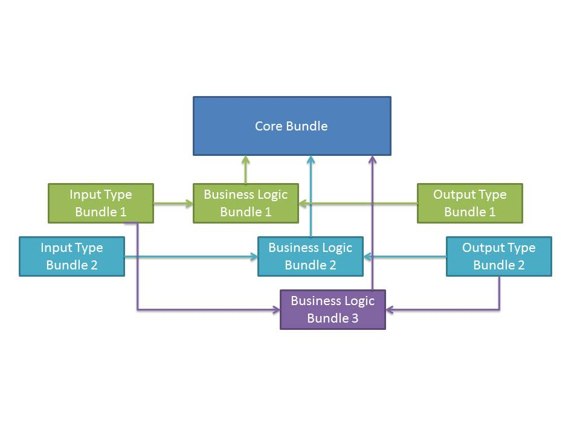

# OSGI ENROUTE EXAMPLES PLUGIN APPLICATION

Question on Stack Overflow:

> I had created few bundles in my application. I want to plug those bundles like this:
> 
> I want to plug in and plug out these bundles.
 
It sounds like you're looking for a _plugin model_ and chose OSGi but you have no idea how to do this?

If you want to create a plugin model in OSGi then you use _services_. Services define a contract _between_ bundles. So in this case your Core Bundle has a number of places where you business logic could 'plug-in'. For each of these places you you need to define the _service contract_. A service contract is defined by a Java package, it usually requires one or more interfaces. By using Java, we can use the compiler to ensure many of the conditions of the contract during compilation. (And we get the added benefit of navigation and refactoring.)

Now in your Core Bundle you will have _components_. These components do the actual work in OSGi. To use the plugins in a component the component depends on the plugin services.

So lets say you have a component that needs to know the price of a product but that price can come from eBay, Amazon, or Ali Baba. So we first design the service contract:

    public interface SupplierPlugin {
        Set<Product> findProducts( String query ) throws Exception;
        boolean buy( String id, String count) throws Exception;
        String getSupplierId() throws Exception;
    }

    public class Product extends DTO {
        public String     supplier;
        public String     id;
        public String     name;
        public String     description;
        public Price      price;
        public int        inStock;
        public int        deliveryTimeInDays;
    }

So how does this look in your _component_?

    @Component
    public class OrderProduct implements REST {

         @Reference
         volatile List<SupplierPlugin> suppliers;

         public Product findProducts(String query) {
             Product cheapest=null;

             return suppliers.stream()
                 .flatMap( supplier -> supplier.findProducts(query) )
                 .sorted( (a,b) -> a.price.compareTo(b.price) )
                 .first();
         }

         public boolean buy(String supplier, String productId)  {        
             return suppliers.stream()
                 .filter( supplier -> 
                      supplier.getSupplierId().equals(supplier) )
                 .map( supplier -> supplier.buy( productId ) )
                 .findFirst();
         }
     }

So how would you implement a SupplierPlugin?

    @Component
    public class TestSupplier implements SupplierPlugin {

         @Reference
         DTOs dtos;

         static Product[] products;
                 
         @Activate
         void activate() {
             InputStream in = TestSupplier.class
                 .getResourceAsInputStream("products.json");
             products = dtos.decoder(Product[].class).get( 
         }

         public Set<Product> findProducts( String query ) {
            return Streams.of(products)
                .filter( product -> product.description.contains(query) )
                .collect( Collectors.toSet() );
         }
    }

## This Implementation

This project is an OSGi enRoute example that demonstrates the shown code. You can run this code by:

* Select `osgi.enroute.examples.plugin.bndrun`. 
* Call up the context menu and select `Debug As/Bnd OSGi Run Launcher`
* Click on http://localhost:8080/osgi.enroute.examples.plugin/index.html#/
* Type in `wifi` in the search box and search

In the src directory you'll find the API for the plugin (`osgi.enroute.examples.plugin.api`), the application code that offers a REST interface is in `osgi.enroute.examples.plugin.application` and the plugin is in `osgi.enroute.examples.plugin.test.provider`.

## Conclusion

So the crucial difference between your terminology and the actual way to write plugins in OSGi is really the simple fact that Bundles are more or less _invisible_. The design is 100% around the services.

Feedback via PRs appreciated.

